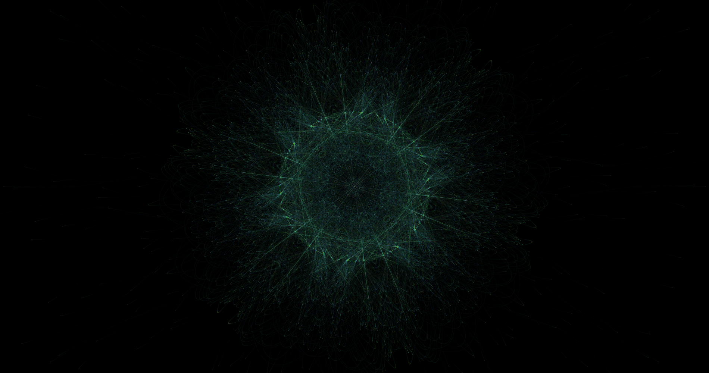

# Force-1
Creating Rosaces out of steering force.

## Description
A bunch of invisible targets are places in circle in the middle of the screen with a random radius.
Another bunche of particles with a velocity and a mass are randomly placed in the canvas.
Then a single target is choosen randomly and is assigned as a target for each particle, then each particle is drawn to the target, leaving a trail behind itself.

During the execution of the program, the target will randomly change and be assigned to all particles.
Each target as a random color, the particle uses its current target's color to display itself.

## Usage
Use the panel to change the generation.

Use Generate to generate a new image.

Use Save or press P to save your image.

## Exemples

